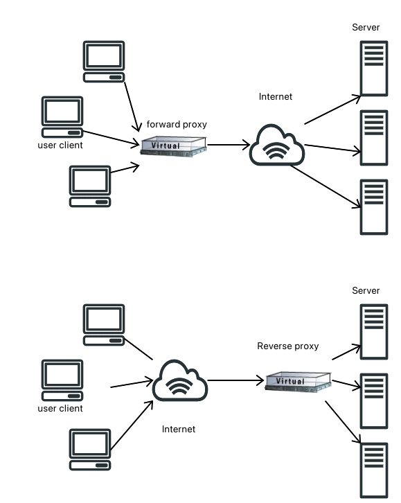

# Go Balancer


[](/License/Mizumoto%20General%20Public%20License%20v1.2.md)

[](https://github.com/mizumoto-cn/GoBalancer/actions)
[](https://goreportcard.com/report/github.com/mizumoto-cn/gobalancer)
[](https://www.codefactor.io/repository/github/mizumoto-cn/gobalancer)
[](https://codecov.io/gh/mizumoto-cn/GoBalancer)
[](https://golang.org/doc/install)

```golang
  ________      __________        .__                                    
 /  _____/  ____\______   \_____  |  | _____    ____   ____  ___________ 
/   \  ___ /  _ \|    |  _/\__  \ |  | \__  \  /    \_/ ___\/ __ \_  __ \
\    \_\  (  <_> )    |   \ / __ \|  |__/ __ \|   |  \  \__\  ___/|  | \/
 \______  /\____/|______  /(____  /____(____  /___|  /\___  >___  >__|   
        \/              \/      \/          \/     \/     \/    \/
```  

A tiny payload balancer written in go. Based on net/http/httputil. An layer-7 application and also a payload-balancing algorithm library.

## Quick Start

### Install

First, clone the repository.

```bash
  git clone https://github.com/mizumoto-cn/GoBalancer.git
```

and build the binary.

```bash
  cd GoBalancer
  go build
```

### First Run

You need to create a config file first, see example config file at [config.yml](config.yml).

And then, you can run the binary.

On Linux/UNIX, you can use `./GoBalancer` to run the binary.

```bash
  ./GoBalancer
```

On Windows, you can use `GoBalancer.exe` to run the binary.

```bash
  ./GoBalancer.exe
```

And you'll see the following output:

```bash
PS D:\Reposits\GoBalancer> .\gobalancer.exe
Schema: http
Port: 8089
HealthCheck: false
MaxConnections: 0

  ________      __________        .__
 /  _____/  ____\______   \_____  |  | _____    ____   ____  ___________
/   \  ___ /  _ \|    |  _/\__  \ |  | \__  \  /    \_/ ___\/ __ \_  __ \
\    \_\  (  <_> )    |   \ / __ \|  |__/ __ \|   |  \  \__\  ___/|  | \/
 \______  /\____/|______  /(____  /____(____  /___|  /\___  >___  >__|
        \/              \/      \/          \/     \/     \/    \/

Pattern: /
ProxyPass: [http://192.168.1.1 http://192.168.1.2:1015 https://192.168.1.2 http://my-server.com]
BalanceMode: round_robin
```

## Forward Proxy and Reverse Proxy

Maybe most of us have used proxies. A forward proxy can be roughly defined as a domain between user client and the internet, which hides the real client from the internet, acting as if they(proxies) are users themselves.

And vice versa. So there are reverse proxies hiding concrete servers from the client. Like the pic shown beneath.



So here in [httputilDemo](httputilDemo/main.go), I will show you how to create a simple reverse proxy.

## Architecture

Try show the architecture of the project in tree diagram below.

```boo
.
├── balancer # Load balancers
├── proxy    # proxies
└── util     # utilities
```

Go Balancer is a light-weight payload balancer.
It has no complex architecture, basically only uses the factory pattern in balancer registry and creation.

Let's start with the payload balancer part.

### Balancer

Balancer is a interface that defines the payload balancer with the following methods.

[Balancer](balancer/balancer.go) <!-- markdownlint-disable MD010-->

```golang
type Balancer interface {
	AddHost(host string) error
	RemoveHost(host string) error

     // choose a host from the list regarding the key
	BalanceHost(key string) (string, error)

    // increase the number of connections to the host by 1
	Inc(host string) error          

    // decrease the number of connections to the host by 1        
	Done(host string) error                 
}
```

After understanding the abstract of Balancer, let's start to implement the balancer algorithms.

There will be 7 algorithms implemented in this project:

- random
- round-robin
- power-of-two random choice
- consistent hash
- consistent hash with bounded capacity
- ip-hash
- least-loaded

### Factory Pattern

The factory pattern is used to create the balancer. We defined a `Factory` function that returns a `Balancer` interface.

Then we use `Build()` function to create the balancer through the factory by calling the `factory` function.

The factory pattern is defined as follows at [balancer.go](balancer/balancer.go).

```golang
// factory design pattern
type factory func([]string) (Balancer, error)

// factoriesMap is a map of algorithm name to factory function
var factoriesMap = make(map[string]factory)

// Build returns a Balancer instance based on the algorithm name
func Build(algorithm string, hosts []string) (Balancer, error) {
	if factory, ok := factoriesMap[algorithm]; ok {
		return factory(hosts) //, nil
	}
	return nil, ErrBalancerAlgorithmNotFound
}
```

For each load balancer algorithm, we register them into the `factories` map in `init()` function.

Take [`round-robin`](balancer/round_robin.go) as an example:

```golang
// Register RoundRobin as a balancer algorithm in the factories map.
func init() {
	factoriesMap["round_robin"] = NewRoundRobin // register the factory function
}

func NewRoundRobin(hosts []string) (Balancer, error) {
	return &RoundRobin{i: 0, hosts: hosts}, nil
}
```

### Health Check

In general, we follow these rules to set health check tests in multi-service architecture:

- between service providers and consumers, making sure the service invocation is available
- between registrar and service providers, making sure the registry knows the service provider is available
- between registrar and service consumers, making sure the registry knows the service consumer is available

Herein, both service providers and consumers are the clients to the registrar.

We don't really need to implement this project to be part of a multi-service architecture thus we only set health check tests between the proxy and the service-providing servers( as clients).

I'd rather prefer clients sending heartbeats to the registrar regularly than to implement the health check tests in the proxy but it will make the project too complicated for its potential application scenarios.

### Util & Configure

We set separated utilities in the [`util` package](util/util.go), while the configuration is in the `main` package.

> To be implemented.

## Algorithms

Typically, we have a set of 7 load balancer algorithms:

- random [](/balancer/random.go)
- round-robin [](/balancer/round_robin.go)
- power-of-two random choice [](/balancer/p2c.go)
- consistent 
- consistent hash with bounded capacity 
- ip-hash [](/balancer/ip_hash.go)
- least-loaded [](/balancer/least_loaded.go)
  
Thank tencentyun/tsf-go for [practical p2c algorithm implementation](https://github.com/tencentyun/tsf-go/blob/master/balancer/p2c/p2c.go) examples.
